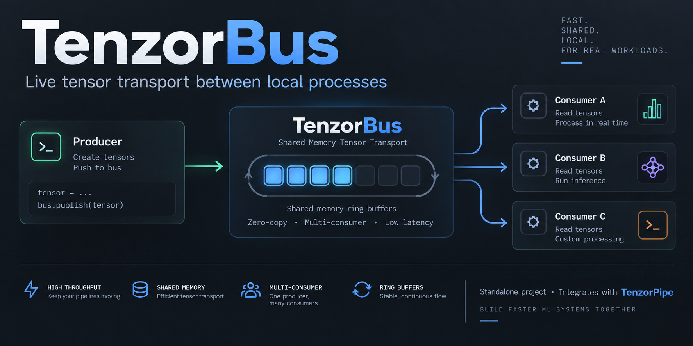
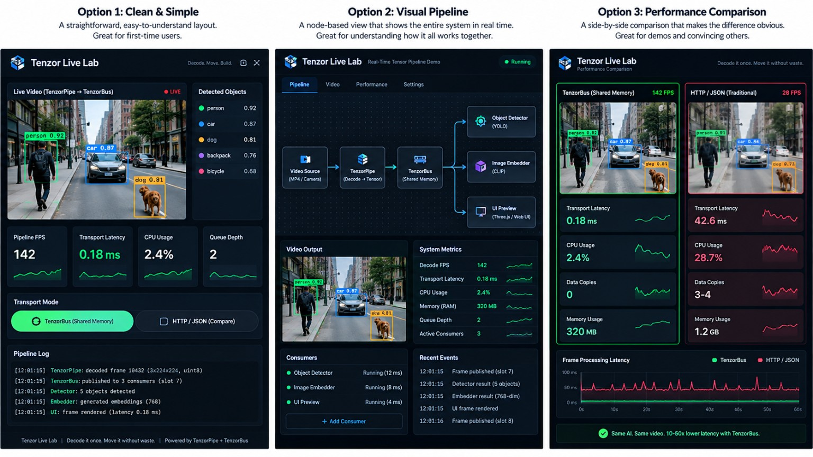

# TenzorBus



**Move tensors between local programs without JSON, base64, or duplicate
consumer buffers.**

TenzorBus is a bounded shared-memory transport for one producer and multiple
local consumers. A producer publishes a tensor once; registered consumers read
the same slot through zero-copy NumPy or PyTorch views.

> Decode it once. Move it without waste.

`v0.1.0-alpha.2` is a Linux-focused engineering prerelease with native x86-64
and ARM64 support. TenzorBus is a new, standalone project; TenzorPipe is an
integration target, not part of this repository.

## What is included

- A Rust shared-memory ring using `shm_open`/`mmap`, atomics, futex wait/wake,
  bounded slots, backpressure, and crash-recoverable consumer registration.
- Python bindings exposed as `tenzorbus_rs`, with zero-copy NumPy and PyTorch
  consumer views and enforced lease lifetimes.
- A Python reference implementation that locks down protocol behavior.
- A frozen wire layout with cross-language parity and golden-byte tests.
- A scoped TenzorPipe v0.3.2 integration patch for decoder-to-slot direct write.
- Integration, negative-control, stress, soak, TSan, and transport benchmark
  harnesses.
- Reproducible CI pinned to Rust 1.98.1.

## Supported platforms

| Platform | Native runtime CI | Production wheel |
|---|---|---|
| Linux x86-64 | Yes | `cp311-abi3-manylinux_2_34_x86_64` |
| Linux ARM64 | Yes, on GitHub-hosted `ubuntu-24.04-arm` | `cp311-abi3-manylinux_2_34_aarch64` |

Both native extensions use the Python 3.11 stable ABI and require glibc 2.34 or
newer. The frozen protocol remains version 1 with the same byte layout on both
architectures. See [`docs/PLATFORMS.md`](docs/PLATFORMS.md) for the architecture
contract, native validation scope, and remaining limitations.

## Quick start

Build the Rust workspace and Python extension on Linux:

```bash
python3 -m venv .venv
. .venv/bin/activate
python -m pip install --upgrade pip
python -m pip install numpy maturin pytest
scripts/build_rust.sh
```

Publish once and read the same slot through a NumPy view:

```python
import numpy as np
import tenzorbus_rs as tenzorbus

bus = tenzorbus.create("frames", slots=16, slot_bytes=1 << 20)
producer = bus.producer()
consumer = bus.consumer()

producer.publish(np.ones((3, 224, 224), dtype=np.float32))
with consumer.next() as lease:
    frame = lease.numpy()
    print(frame.shape, frame.mean())
    del frame  # exported views must not outlive the lease

consumer.close()
del consumer
del producer
bus.unlink_on_close()
del bus
```

`Ring` does not have a `close(unlink=True)` method. `unlink_on_close()` makes
the creator remove the shared-memory name when the last in-process ring handle
is dropped; `keep_on_close()` disables that behavior. To remove the name
immediately, call the module-level `tenzorbus.unlink(name)`. Existing attached
handles remain usable until they are dropped, but new `attach(name)` calls fail
after an unlink.

### Creating an existing name

`tenzorbus.create(name, ...)` fails with `RuntimeError` when `name` already
exists. This matches the reference implementation and prevents an accidental
second creator from silently replacing the name. Replacement must be explicit:

```python
replacement = tenzorbus.create(
    "frames", slots=16, slot_bytes=1 << 20, force=True
)
```

`force=True` unlinks the existing name and creates a new ring at that name.
Already-open handles continue to refer to the old, anonymous mapping; new
`attach("frames")` calls refer to the replacement. Coordinate replacement with
all participating processes rather than using it as a reset while a pipeline
is active. In particular, a live creator of the old ring must call
`keep_on_close()` before replacement so its eventual shutdown cannot unlink the
replacement's name.

For a producer that can generate directly into the bus:

```python
with producer.reserve("float32", (3, 224, 224)) as writer:
    destination = writer.numpy()
    generate_into(destination)
    writer.set_timestamp_ns(media_timestamp_ns)
```

## Verification

The release-candidate verifier checks the pinned Rust toolchain, locked release
build, formatting, clippy with warnings denied, dependency licenses, Rust and
strict Python tests, real TenzorPipe v0.3.2 integration, byte identity against a
pristine build, direct-write copy accounting, negative controls, stress/soak
gates, TSan and its positive control, and the fail-closed benchmark matrix.
The separate ARM64 job runs the normal Rust transport suite and Python
API/lifetime tests natively, installs the ARM64 wheel into a clean environment,
performs a real shared-memory roundtrip, and builds TenzorPipe v0.3.2 natively
to verify a real direct-write TenzorPipe -> TenzorBus -> NumPy consumer flow.

```bash
TENZORPIPE_DIR=/path/to/patched/tenzorpipe \
TENZORPIPE_BIN=/path/to/patched/tenzorpipe/target/release/tenzor \
PRISTINE_TENZOR=/path/to/pristine/tenzorpipe/target/release/tenzor \
scripts/verify_release_candidate.sh
```

The alpha.0 accepted Linux verification recorded 47 Rust tests and 48 Python
tests after the four benchmark-harness regressions were added, zero skips, 58
byte-identical TenzorPipe cases plus two matching refusals, and zero corruption
or ordering failures in stress/soak gates. See `FINAL_VERIFICATION.md` and the
reports under the repository root for scope and evidence.

## Final EPYC x86-64 benchmark

The authoritative matrix completed **49/49 cases with zero errors** on an
**AMD EPYC 9V74, 9-vCPU Linux x86-64 KVM** host. It covers TenzorBus copy,
measured direct fill, the in-place-generation floor, Unix stream sockets,
FIFOs, localhost HTTP binary, and HTTP JSON/base64. It is not ARM64 benchmark
evidence, and alpha.2 does not change or rerun it.

TenzorBus does not win every single-consumer latency or throughput metric. Its
primary design target is shared-memory fan-out and copy scaling: one publication
and one producer-side copy for an existing payload, with zero-copy consumer
views as the consumer count grows.

At the real 602,112-byte TenzorPipe frame size with four consumers, the accepted
run measured:

| Path | Median | p95 | Publications/s | Total copies |
|---|---:|---:|---:|---:|
| TenzorBus copy | 0.1186 ms | 0.3382 ms | 6,637.4 | 1 |
| TenzorBus direct | 0.0585 ms | 0.1293 ms | 10,360.6 | 1 |
| Unix stream socket | 0.1822 ms | 0.4940 ms | 1,135.6 | 5 |
| FIFO | 0.3275 ms | 0.5982 ms | 695.7 | 5 |
| HTTP binary | 0.1459 ms | 0.3634 ms | 984.7 | 9 |
| HTTP JSON/base64 | 2.6590 ms | 4.3261 ms | 35.9 | 15 |

`tenzorbus_direct_nofill` is deliberately omitted from this like-for-like table:
it is an in-place-generation transport floor whose fill/generation is excluded.
It must not be presented as directly comparable to paths copying an existing
payload.

The EPYC VM blocked pathname Unix sockets at `socket(AF_UNIX, ...)`. The seven
Unix rows use real `AF_UNIX/SOCK_STREAM` socketpairs inherited by independent
consumer processes across `exec`; no Unix cases were skipped. See
[`BENCHMARKS.md`](BENCHMARKS.md) for all 49 rows and exact methodology.

## TenzorPipe v0.3.2 integration

The patch in `patches/tenzorpipe-v0.3.2-direct-write.patch` adds a destination
sink without changing the normal `.tenzor` path. The integration bridge reserves
a TenzorBus slot, gives its payload to the decoder, and commits the exact slot
consumers subsequently read. Unsupported direct-write execution modes fail
clearly rather than silently falling back to a copy.

The release gates include exact-byte pristine-versus-patched comparison,
consumer-side tensor re-derivation, frame/timestamp corruption negative
controls, sequence and slot tracing, producer-copy accounting, and killed
producer/consumer recovery.

## Benchmark harness safety

`benchmarks/benchmark_matrix.py` is fail-closed:

- any exception, child-process failure, missing report, invalid metric, or
  incomplete delivery stops the run with a nonzero status;
- every full run must contain exactly 49 complete cases and seven cases per
  transport;
- Unix rows must identify the selected real `AF_UNIX/SOCK_STREAM` mechanism;
- failed or partial output is marked `benchmark_status: failed` and cannot be
  mistaken for a complete matrix.

## Scope and limitations

- Linux x86-64 and Linux ARM64 are the supported production targets for this
  alpha. Both are little-endian 64-bit targets with native 16/32/64-bit
  atomics.
- ARM64 validation covers the Rust transport, NumPy/PyO3 API, and the real
  TenzorPipe v0.3.2 direct-write integration. Optional PyTorch ARM64 view tests
  are not part of the native gate because PyTorch is not installed there.
- The ThreadSanitizer gate remains on Linux x86-64; ARM64 receives native
  functional, process, lifecycle, and clean-wheel runtime coverage.
- Windows/macOS transport support and the C ABI remain future work.
- TenzorBus is local IPC infrastructure, not an inference server, model host,
  distributed cluster, or game engine.
- Tenzor Live Lab is intentionally deferred until after this engine release.

## Future Tenzor Live Lab direction

The approved Option 1 direction is retained for the later demo phase. Values in
this concept image are illustrative; the implementation must use real telemetry
and measured results.



## Contact

- For technical support and bug reports, use
  [GitHub Issues](https://github.com/jay-showforge/TenzorBus/issues).
- For commercial licensing, email
  [licensing@tenzorpipe.org](mailto:licensing@tenzorpipe.org).
- Visit [tenzorpipe.org](https://tenzorpipe.org) for the Tenzor ecosystem.

## License

TenzorBus is prepared under the Business Source License 1.1 with the Additional
Use Grant in [`LICENSE`](LICENSE). Review the license before public release.
